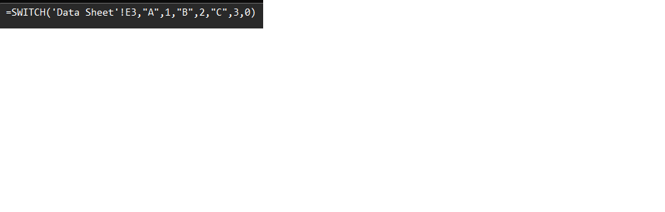
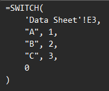

# Northbound Excel Add-in

A public Excel add-in from Northbound Group. This repo holds the add-in's
VBA source (`.bas`/`.cls` modules and Ribbon XML), version-controlled
separately from the built `.xlam` file.

## Features

### Pretty Print / Minify

Reformats Excel formulas for readability (Pretty Print), or collapses them
back down (Minify). Available from the Northbound ribbon tab, at the cell,
range, sheet, and workbook level.

More features will be added here as they are carved out of Northbound's
internal add-in.

| Before | After |
|---|---|
|  |  |

## Installation

1. Download the latest release:
   https://github.com/StephenDeetz/northbound-excel-vba-addin/releases/latest
2. Verify the download's SHA-256 hash matches the value published on the
   release page. On Windows: `certutil -hashfile Northbound.xlam SHA256`
3. Add the `.xlam` file as an Excel add-in. For step-by-step instructions,
   including unblocking the file and setting up a trusted location, see
   [INSTALL.md](INSTALL.md).

## Source Code

This repo contains the add-in's source for transparency and version
history. There is no build step -- the `.xlam` is assembled in Excel's
VBA editor (VBE) and its modules are exported here as plain text files.
See `CLAUDE.md` for the development workflow.

## License

MIT -- see [LICENSE](LICENSE).

## Links

- Website: https://northboundgroup.com/
- Issues / Source: https://github.com/StephenDeetz/northbound-excel-vba-addin
